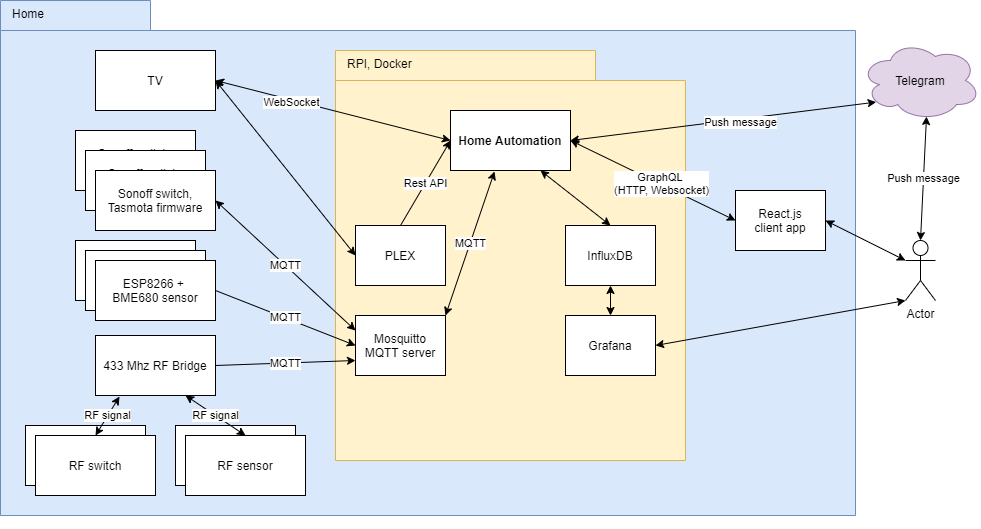

# Otthon automatizálás

A projekt célja egy mini alkalmazás létrehozása, az egyszerű otthon automatizálás feladatok elvégzésére.

A program [Kotlin](https://kotlinlang.org/) programozási nyelv, és [Spring framework](https://spring.io/projects/spring-boot) segítségével készült.

Az otthon automatizálásban részt vevő eszközöket, és taszkokat Kotlin
nyelvben kell leírni, ezek a program részeként futnak. Erre egy egyszerű [DSL](https://kotlinlang.org/docs/reference/type-safe-builders.html) nyelv  
(illetve a Kotlin nyelv, és környezet minden lehetősége) használható.
A cél, hogy ne nehézkes paraméterezéssel kelljen leírni az otthon automatizálási feladatokat, hanem rugalmas lehetőségekkel egy egyszerű programnyelv segítségével.

@@@ TODO

## A rendszer felépítése



## Beeper

A beeper Raspberry PI-n, Raspbian operációs rendszer alatt lett tesztelve, de egyéb linux operációs rendszereken is működhet, olyan számítógépen, ahol a beeper ráköthető egy GPIO portra.

A beeper használatához az operációs rendszerben engedélyezni kell a GPIO portokat.

A beeper bekapcsolásához az ```application.yml```-ben a ```beeper.enabled``` property-t ```false```-ról 
```true```-ra kell állítani. A PIN a ```beeper.pinNumber``` property-vel adható meg. 

Példa a beeper használatása: 
- Ajtónyitás jelzése

A következő eljárás hívás 100 ms-ra bekapcsolja a beepert, majd 50 ms-ra kikapcsolja, és ezt megismétli háromszor:

```
beeperService.beep(100, 50, 100, 50, 100, 50)
```

## Üzenetküldés

A program Telegram segítségével tud üzenetet küldeni. 

Példák, hogy mikor lehet érdemes üzenetet küldeni: 
- A vízértékelő szenzor jelez (mert csőtörés van)
- Csengett valaki 
- stb..

Beállítások elvégzése az üzenetküldéshez:

1. A telegram-on kell létrehozni egy bot-ot, ezt a BotFather bot-tól kell kérni.
2. Bot létrehozáskor a BotFather a bot nevét, és a userId-jét fogja megkérdezni.
3. A HTTP API-hoz kapott tokent az ```application.yml```-ben kell beállítani a ```telegram.botToken``` beállításban.
4. Létre kell hozni egy private channelt, és meg kell hívni bele a bot-ot admin-ként, és a felhasználókat.
5. A channel-t meg kell nyitni egy webböngészőben, és az channel_id-t az URL-ből kell kinyerni:
    1. Pl. ez az URL: https://web.telegram.org/#/im?p=c1234567890_1234567890123456789
    2. Ekkor a channel ID a c és a _ jel közötti rész, de elé kell írni, hogy -100, tehát ez lesz: -1001234567890 
    3. Tehát a channel ID egy - jel, és 13 db szám.
    4. A kapott channel ID-t az ```application.yml```-ben kell beállítani, a ```telegram.chatId``` beállításban.

Példa az üzenetküldésre:

```
telegramService.sendNotification("Riasztás! Vízelfolyás érzékelő (mosogatógép).")
```

## Napkelte, napnyugta szolgáltatás használata

@@@ TODO

## Banner készítő

http://patorjk.com/software/taag/#p=display&f=Small&t=
