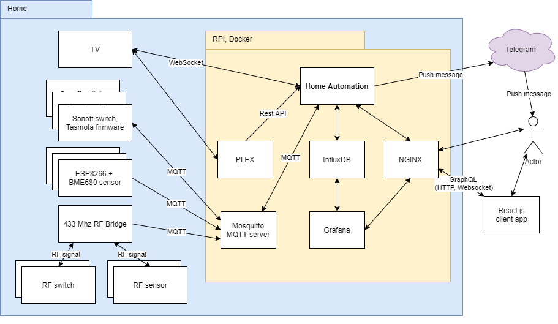

# Otthon automatizálás

A projekt célja egy mini alkalmazás létrehozása, az egyszerű otthon automatizálás feladatok elvégzésére.

A program [Kotlin](https://kotlinlang.org/) programozási nyelv, és [Spring framework](https://spring.io/projects/spring-boot) segítségével készült.

Az otthon automatizálásban részt vevő eszközöket, és taszkokat Kotlin
nyelvben kell leírni, ezek a program részeként futnak. Erre egy egyszerű [DSL](https://kotlinlang.org/docs/reference/type-safe-builders.html) nyelv  
(illetve a Kotlin nyelv, és környezet minden lehetősége) használható.
A cél, hogy ne nehézkes paraméterezéssel kelljen leírni az otthon automatizálási feladatokat, hanem rugalmas lehetőségekkel egy egyszerű programnyelv segítségével.

@@@ TODO

## A rendszer felépítése



## Beeper

A beeper Raspberry PI-n, Raspbian operációs rendszer alatt lett tesztelve, de egyéb linux operációs rendszereken is működhet, olyan számítógépen, ahol a beeper ráköthető egy GPIO portra.

A beeper használatához az operációs rendszerben engedélyezni kell a GPIO portokat.

A beeper bekapcsolásához az ```application.yml```-ben a ```beeper.enabled``` property-t ```false```-ról 
```true```-ra kell állítani. A PIN a ```beeper.pinNumber``` property-vel adható meg. 

Példa a beeper használatása: 
- Ajtónyitás jelzése

A következő eljárás hívás 100 ms-ra bekapcsolja a beepert, majd 50 ms-ra kikapcsolja, és ezt megismétli háromszor:

```
beeperService.beep(100, 50, 100, 50, 100, 50)
```

## Üzenetküldés

A program Telegram segítségével tud üzenetet küldeni. 

Példák, hogy mikor lehet érdemes üzenetet küldeni: 
- A vízértékelő szenzor jelez (mert csőtörés van)
- Csengett valaki 
- stb..

Beállítások elvégzése az üzenetküldéshez:

1. A telegram-on kell létrehozni egy bot-ot, ezt a BotFather bot-tól kell kérni.
2. Bot létrehozáskor a BotFather a bot nevét, és a userId-jét fogja megkérdezni.
3. A HTTP API-hoz kapott tokent az ```application.yml```-ben kell beállítani a ```telegram.botToken``` beállításban.
4. Létre kell hozni egy private channelt, és meg kell hívni bele a bot-ot admin-ként, és a felhasználókat.
5. A böngészőben a következő URL-el tudod lekérdezni a channel ID-t (a ${botTokent} palceholdert ki kell cserélned):
   https://api.telegram.org/bot${botToken}/getUpdates
    4. A kapott channel ID-t az ```application.yml```-ben kell beállítani, a ```telegram.chatId``` beállításban.

Példa az üzenetküldésre:

```
telegramService.sendNotification("Riasztás! Vízelfolyás érzékelő (mosogatógép).")
```

## A frontend-hez a csomagok telepítése, fordítás
```
cd vsha-frontend
rm -rf node-modules
npm install --ignore-scripts
npm run build
cd ..
```

## Kapcsolódás távoli docker-hez

- A szerver és a kliens gépre is telepíteni kell a dockert.
- TLS kulcsokat kell generálni a következő cikk szerint: 
  https://docs.docker.com/engine/security/protect-access/
  A kulcsokat be kell állítani szerver és kliens oldalon is.
- Kliens oldalon docker context-et érdemes készíten, példa:
```
$ docker context create my-context --description "some description" --docker "host=tcp://myserver:2376,ca=~/ca-file,cert=~/cert-file,key=~/key-file"
```
- A docker konténerek build-eléséhez be kell lépni a docker context-be:
```
$ docker context use my-context
```
- Indítás:
```
$ docker-compose up -d
```
- Kilépés a context-ből:
```
$ docker context use default
```

##  Beállítások
A beállításokat a .env file-ban kell megadni. Lásd: env.template
